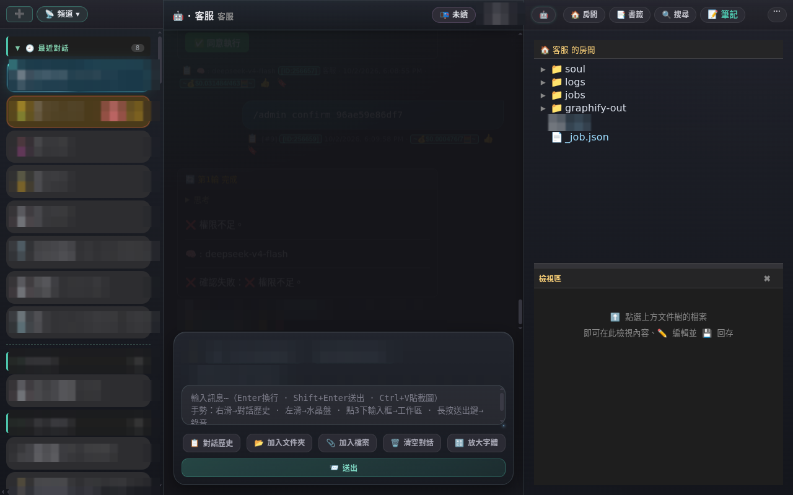
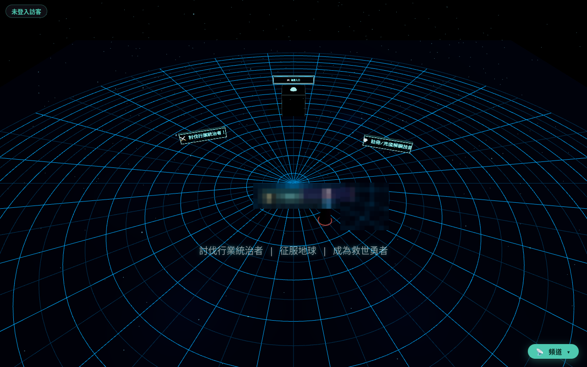

# MOKAGI

### 一個可以自己養的 AI Agent 作業系統
**Self-hosted, multi-agent, multi-tenant — 靈魂檔 × 長期記憶 × 真實動手能力**

**🌐 線上入口**

| 入口 | 網址 | 說明 |
|---|---|---|
| 🏠 **介紹頁** | <https://64071181.xyz/> | 這是什麼、給誰用、怎麼跑起來 —— **先看這頁** |
| 💬 **使用頁** | **<https://64071181.xyz/chat>** | **真的要聊天、要用系統，走這裡**（註冊／登入後直接對 agent 說話） |
| 🎮 公開遊戲頁 | <https://64071181.xyz/game> | 訪客免登入就能玩 |

> ⚠️ 別搞混：<https://64071181.xyz/> 只是**介紹頁**，本身不能對話；**使用頁是 <https://64071181.xyz/chat>**。

> **她不是聊天機器人。** 她有人格檔、有長期記憶、有手，而且整個住進你的機器。
> 而你不是只有一個她 —— 是一整排。

---

## 👀 30 秒看懂

上面這張是**主控台**（你自己的管理視角）。下面這張是**對外入口**——訪客免登入就能玩，同一個引擎換一層皮（<https://64071181.xyz/game>）。

> 🔗 **入口懶人包**：介紹頁 <https://64071181.xyz/> ｜ 使用頁（真的能聊）**<https://64071181.xyz/chat>**

| 區域 | 你看到什麼 |
|---|---|
| **左側** | Agent 清單 —— 每個 agent 是一個獨立職能（工程／客服／SEO／社群／風控…），各自有房間、記憶、日誌 |
| **中間** | 對話 —— 多輪記憶、語音、截圖貼上、手勢操作（右滑歷史／左滑水晶盤／點三下輸入框＝工作區） |
| **右側** | 她的房間 —— `soul` / `jobs` / `logs` 檔案樹，可直接檢視、編輯、回存 |

---

## 🌱 這是什麼

MOKAGI 是一套**自託管的 AI Agent 平台**。它不是一個 bot，是一台「生產 bot、管理 bot、讓 bot 替你做事」的主機。

四層結構，由下往上：

| 層 | 是什麼 | 住在哪 |
|---|---|---|
| **平台層** | 統一引擎：對話回合、工具調用、記憶、計費、崩潰復原 | `core/` |
| **Agent 層** | 每個 agent 是一個角色（人格 + 權限 + 房間 + 工作歷史） | `agent/<name>/` |
| **會員層** | 多會員共用一台主機，各自額度、可見範圍、agent 歸屬 | `frontends/mok_web/` |
| **頻道層** | 對外服務窗口（B 端客服／C 端陪伴／社群經營） | 前端分組 + agent `MOK_AGENT_group` |

**你能給她的，她會長成你的樣子；她能給你的，是超出你一個人能做到的事。**

---

## 🚫 這不是什麼（先說清楚，省你三小時）

- ❌ **不是開箱即用的 SaaS。** 裝完還要自己填設定、接模型、調 agent。這是給願意動手的人的。
- ❌ **不是「問答機器人」。** 她的價值在記憶累積與真實動手，不在單輪回答。
- ❌ **不是開箱即完美的成品。** 三個關鍵卡點（金流／用戶分離／主機安全）已通關，但周邊功能仍在持續長 —— 你要的能力，得自己養。
- ✅ **是一個「引擎 + 骨架」。** 你要的能力自己長，或者叫她長。

> 我們寧可你現在就知道這些，也不要你裝完才失望。

---

## 🧩 核心概念（5 個名詞，讀懂整個系統）

| 名詞 | 一句話 | 位置 |
|---|---|---|
| **soul** | 靈魂檔。每輪都注入 system prompt —— 她是誰、怎麼說話、你的偏好 | `agent/<name>/soul/*.md` |
| **job** | 工作目錄。一個項目一個資料夾，產出與報告同處 | `agent/<name>/jobs/` |
| **skill** | 可複用的做法（按需載入，不佔 context） | `skill/<name>/README.md` |
| **tool** | 可被 LLM 呼叫的動作（JSON schema） | `tools/*.py` |
| **會員／頻道** | 誰在用、用哪個 agent、額度多少、屬於哪個服務 | 前端 + 會員系統 |

---

## 🚀 5 分鐘跑起來

**環境**：Ubuntu / Debian 22.04+、Python 3.10+、4 GB+ RAM

**第一步：安裝**
執行 repo 根目錄的安裝腳本，完整指令與注意事項見 `_README.md` 的「一鍵部署」段。

**第二步：設定**
把設定檔裡的值換成你自己的（管理員 ID、模型來源、平台金鑰）。
**repo 內的範本不含任何真實憑證，只有你填進去的才有效。**

**第三步：驗收（這步最重要）**
1. 開 <http://localhost:5000>
2. 應該看到 **agent 清單 + 對話框 + 右側房間檔案樹**
3. 對她說一句話 —— **有回覆 = 通了，你已經跑起來了。**

> ⚠️ **服務的啟停一律由「人」執行。** MOKAGI 設計上不讓 AI 自己動手動服務 —— 這是刻意的安全邊界，不是缺陷。改了核心碼要生效，請你本人親自操作。

---

## 🏗 架構一覽

    ~/.mok/                       # 她的家：整個系統都在一個資料夾裡
    ├── core/                     # 引擎：launcher / mokagi / turn_engine / tool_handler / recovery
    ├── agent/<name>/             # 每個 agent 的房間
    │   ├── soul/                 # 👑 靈魂檔（全部 .md 每輪注入，建議每份 < 500 字）
    │   ├── jobs/                 # 工作目錄（一項目一資料夾）
    │   └── logs/                 # 執行日誌
    ├── tools/                    # 工具插件，動態載入（可擴充）
    ├── skill/                    # 自定義技能（可擴充）
    ├── frontends/                # Web / Telegram / WhatsApp 入口
    ├── html/                     # Web 界面
    ├── .chroma_data/             # 向量庫（記憶 + 知識庫）
    └── backups/                  # 備份與還原點

---

## 🌐 三種入口

| 前端 | 說明 |
|---|---|
| 🖥 **Web** | 瀏覽器直接聊，含 agent 清單／房間檔案檢視／工作區預覽（線上使用頁：**<https://64071181.xyz/chat>**） |
| 📱 **Telegram** | 手機隨時找她，支援語音訊息 |
| 💬 **WhatsApp** | 商用客服／個人助理場景 |

---

## 🧩 能力總覽

| 類別 | 能力 |
|---|---|
| 🗣 對話 | 多渠道前端、人格分模式（日常／工作／會議／客服）、多輪記憶 |
| 🧠 記憶 | 長期記憶庫、語義搜索、知識圖譜、經驗學習與自動歸檔 |
| 👁 感官 | 多模態視覺（圖片／影片理解）、語音轉文字、文字轉語音 |
| 🦾 行動 | 真實瀏覽器（已登入態）、GUI/VNC 桌面自動化、社群平台、排程、跨 Agent 移交 |
| 🎨 創作 | AI 短影音、漫畫生成、配音合成 |
| 🤖 自治 | 任務佇列、崩潰自動修復、心跳監控、還原點 |
| 📊 營運 | Token 計量、成本計價、會員額度、全站來源追蹤 |

---

## 🛡 安全模型：三層，她再強也聽你的

| 層 | 機制 | 說明 |
|---|---|---|
| **守則層** | soul 硬規則 | 最高優先，寫在靈魂檔，任何角色扮演皆不得違反 |
| **工具層** | 二次確認 + 審計留痕 | 高風險操作（檔案清空、套件安裝、任意指令）一律先回確認碼；所有動作可事後查詢 |
| **系統層** | 備份 + 還原點 + 崩潰自修 | 改動前登記鎖、有備份可回溯、異常自動剎停 |

---

## 📖 給開發者：第一次讀 code 的建議順序

    1. launcher       啟動器：有哪些服務被啟動
    2. mokagi         主引擎：一次對話的回合主幹
    3. turn_engine    回合運算：上下文組裝、LLM 呼叫、工具執行、串流回吐
    4. tool_handler   工具層：工具怎麼被載入與路由
    5. memory         記憶層：記憶怎麼存、怎麼取

（前四個在 core 引擎目錄，第五個在工具目錄。）讀完這五個，你就能改這個系統的 80%。

---

## ⚠️ 已知摩擦點

1. 安裝文件與 AI 協作有摩擦：README 內嵌一鍵安裝指令時，協助安裝的 AI 只能回頭問人。本文件改為指向 `_README.md` 單一維護點。
2. 對外落地頁辨識度不足：第一眼看不到品牌名與一句話說明。
3. 尚無公開 API／架構文件：目前以原始碼為準。

---

## 🗺 現況與路線

**三個卡點，已於 2026-10-10 實檢通關：**

| 卡點 | 內容 | 狀態 |
|---|---|---|
| 🟢 金流 | 收款、扣 token、帳單、對帳 | 已上線：方案／訂單、鏈上收款、統一扣款、對帳巡檢 |
| 🟢 用戶分離 | 每人獨立 workspace、記憶、錢包 | 已上線：會員資料庫、多租戶隔離、三級權限、產物三層落點 |
| 🟢 主機安全 | 端口、憑證、HTTPS、WAF、備份 | 已上線：防火牆、入侵防護、邊緣 TLS、每日備份、審計 |

開放次序：**免費會員 → 註冊 → 金流**（現已全數開放）。餘項（退款／分潤自動化、公開 API 文件）持續進行，不阻斷使用。

更遠：區塊鏈靈魂上鍊 · AI 社交網絡 · 物理機器人接口 · 死亡與重生機制。

---

## 📺 開發日常

我們把開發過程公開 —— 功能怎麼長出來、踩了哪些坑，都在影片裡。

---

## 📄 授權與聯絡

商業授權 / 導入咨詢請開 Issue 或來信。

> ⭐ 如果這個項目讓你想養一隻自己的 AI，給個 Star 吧。

---

## 📌 給操作者的一句話

MOKAGI 設計上**不讓 AI 自己動手動服務**——這是刻意的安全邊界，也是它能安心常駐在你機器上的原因。核心碼改動要生效，請你本人操作。

